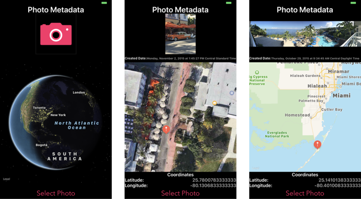

# Photo-Metadata

An example Swift 5 Xcode project used to build an app to read metadata from a selected photo and show the location on a map. 

Project was made to demonstrate the use of Swift's UIImagePickerControllerPHAsset for acquiring a photo's metadata. 

Example for: 
  * UIImagePickerController to select photo from photo library
  * PHPhotoLibrary.requestAuthorization for requesting access from user to the iOS device's photo library
  * MapKit framework with pin, compass and scale
  * Alert directing user to privacy settings in Settings app using UIApplicationOpenSettingsURLString
  * Settings Bundle to allow user customization of app and to display "About" information
  * Auto-Layout Constraints

!

**Technical Info:** \
Xcode 11 project written in Swift 5 for iOS 13\
MapKit, Photos, PHPhotoLibrary.authorizationStatus, UIImagePickerController\
hybridFlyover, MKCoordinate, MKPointAnnotation, alert

**See Also:** \
[Quickies - a variety of example iOS apps](https://github.com/PepperoniJoe/Quickies)\
 [Make Icons Swiftly - used to generate app icon sets
 ](https://github.com/PepperoniJoe/Make-Icons-Swiftly)

**Author:** \
Marcy Vernon [@MarcyVernon](https://twitter.com/MarcyVernon)

**License:** \
"Photo Metadata" is under the MIT license. See [LICENSE](/LICENSE) for more information.
